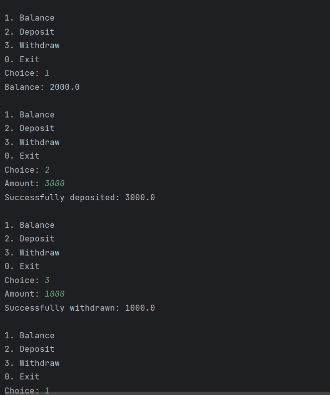

# 💳 ATM Simulation in Java
A robust banking simulation demonstrating core Object-Oriented Programming (OOPS) principles.
A simple console-based ATM simulation project written in Java to practice core programming concepts like:

- ✅ Data types
- ✅ Encapsulation
- ✅ Inheritance
- ✅ Abstraction
  
---

## 📌 Features

- 💰 Check Balance  
- ➕ Deposit Money  
- ➖ Withdraw Money (with validation for insufficient funds)  
- 🔄 Menu-driven interface  
- 🔒 Input validation (no negative or zero deposits/withdrawals)  
- 🔠 Accepts both uppercase and lowercase inputs
- Encapsulation: Private data members for security (PIN, Balance).
- Inheritance: Specialized `SavingsAccount` extending the base `Account`.
- Abstraction: Defined a `Transaction` interface for modularity.
- Exception Handling: Custom `InsufficientFundsException` for error management.

---

## 🛠️ Technologies Used

- Java (JDK 8 or above)
- Command-line interface

---

## 🧠 Concepts Practiced

- Method creation and calling
- Static/global variables
- Scanner input and buffer handling

---

## 🚀 How to Run

1. Clone the repository:
   git clone https://github.com/YOUR_USERNAME/ATM-Simulation.git
2. Navigate to the folder:
   cd ATM-Simulation
3. Compile the program:
   javac Atm.java
4. Run the program:
   java Atm

## 📸 Sample Output

## 📂 File Structure
ATM-Simulation/
├── Atm.java
└── README.md

## 📃 License
This project is open-source and free to use for educational purposes.

## 🙋‍♂️ Author
Kusham Rathee
Feel free to connect on https://www.linkedin.com/in/kusham-rathee-884607244?utm_source=share&utm_campaign=share_via&utm_content=profile&utm_medium=android_app or star this repository if you found it helpful! 🌟
